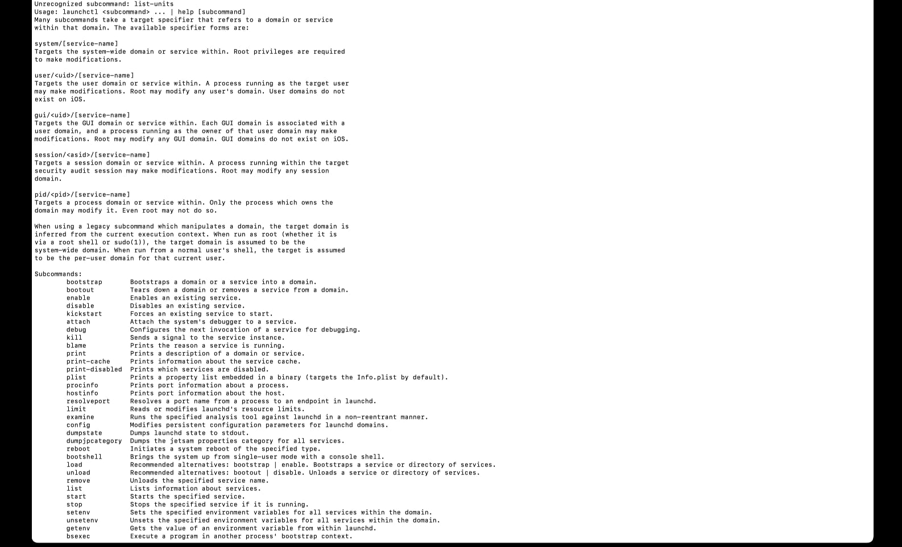

To test the `sysopctl` command and ensure all functionality works as expected, follow these steps:

### **1. Environment Setup**

- Ensure you are running on a Linux machine, as this command interacts with Linux system processes, services, and logs.
- You may need root privileges (use `sudo`) to test commands that start/stop services, view system logs, or monitor system processes.

### **2. Steps to Test**

#### **Step 1: Clone or Setup the Directory**
If you haven't done so already, create a directory for `sysopctl`:

```bash
mkdir sysopctl && cd sysopctl
```

Place all the code files as per the structure described above:

```
sysopctl/
│
├── sysopctl.sh               # Main script
├── functions/
│   ├── service.sh            # Service management
│   ├── system.sh             # System load
│   ├── disk.sh               # Disk usage
│   ├── process.sh            # Process monitoring
│   ├── logs.sh               # Log analysis
│   ├── backup.sh             # Backup
└── VERSION                   # Version information file
```

Make the main script executable:

```bash
chmod +x sysopctl.sh
```

#### **Step 2: Testing Basic Features**
1. **Help Option**:
   To check if the help command works, run:

   ```bash
   ./sysopctl.sh --help
   ```

   You should see a list of available commands and their usage.

2. **Version Information**:
   Test the version flag:

   ```bash
   ./sysopctl.sh --version
   ```

   Expected output: `sysopctl version v0.1.0`.

#### **Step 3: Testing System Operations**

1. **List Running Services**:
   To list active system services (this requires systemd):

   ```bash
   ./sysopctl.sh service list
   ```

   This should display all active services, similar to `systemctl list-units --type=service`.

2. **Start a Service**:
   Test starting a service (for example, `nginx`):

   ```bash
   sudo ./sysopctl.sh service start nginx
   ```

   This should start the `nginx` service and confirm the status.

3. **Stop a Service**:
   Test stopping a service:

   ```bash
   sudo ./sysopctl.sh service stop nginx
   ```

   This should stop the `nginx` service.

4. **Check System Load**:
   To view system load averages:

   ```bash
   ./sysopctl.sh system load
   ```

   This will display the system load, similar to the `uptime` command.

5. **Check Disk Usage**:
   To check disk usage:

   ```bash
   ./sysopctl.sh disk usage
   ```

   The output will be similar to `df -h`.

6. **Monitor System Processes**:
   To monitor real-time processes (similar to `top`):

   ```bash
   ./sysopctl.sh process monitor
   ```

   This should open the `top` process monitor.

7. **Analyze System Logs**:
   To check system logs for critical errors:

   ```bash
   sudo ./sysopctl.sh logs analyze
   ```

   This will analyze the logs using `journalctl -p 3 -xb`.

8. **Backup System Files**:
   To test the backup command:

   ```bash
   ./sysopctl.sh backup /path/to/directory
   ```

   This will copy the specified directory to `/backup/` using `rsync`.

   Ensure the `/backup/` directory exists, or you can modify the backup location in the script.

#### **Step 4: Manual Page Testing**
You can test the manual page (if installed on your system). To install the man page, run:

```bash
sudo cp man/sysopctl.1 /usr/share/man/man1/
sudo mandb  # Rebuild man database
```

Now, you can use:

```bash
man sysopctl
```

This should display the `sysopctl` manual page.

### **3. Root Privileges for System Commands**
Many of these commands, especially those related to managing services, monitoring processes, and system logs, may require root privileges. You can either:

- Run the whole script with `sudo`, like so:

   ```bash
   sudo ./sysopctl.sh <command>
   ```

- Or run specific commands that require higher privileges, such as service management or log analysis, with `sudo`.

### **4. Debugging and Validation**
- **Permissions**: Ensure that the scripts are executable using `chmod +x sysopctl.sh`.
- **Error Handling**: If any command fails, check the specific function script for that command (e.g., `functions/service.sh`) and ensure you are passing valid inputs.
### **4. Screenshot**
 
  



